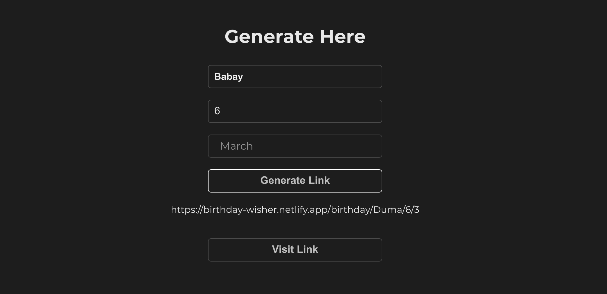
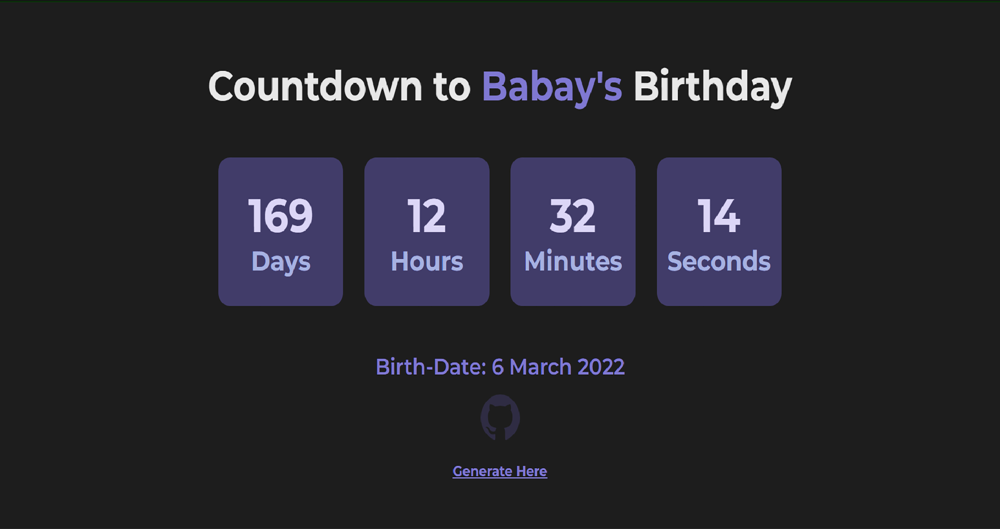
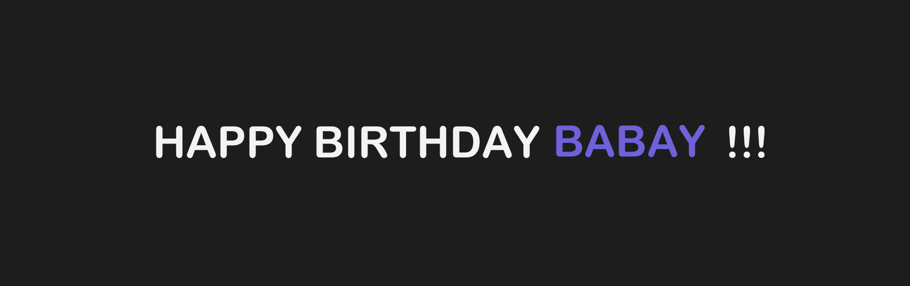

# 🎉Birthday Wisher with Countdown!🎉

Made with React.

## Getting started

You can view a live demo over at https://birthday-countdown-wisher.netlify.app/

To get It running locally:

- Clone this repo
- `npm install` to install all req'd dependencies
- `npm start` to start the local server (this project uses create-react-app)

## Usage:

Visit [https://birthday-countdown-wisher.netlify.app/]()

Enter the `name , put any of the day , select month of birthday`

Click on Generate Link

You Can see a Link being generated Copy or Visit the link by Clicking on the Button

And There You Go ! 🎉

## Birthday Wisher🎂

Loads this Page Instead of Coutdown on the Birthday

It's Fully Responsive and you change styles in the `app.css`

Wishing Component Page : `Wish.jsx`
Countdown Compenent Page : `Countdown.jsx`
